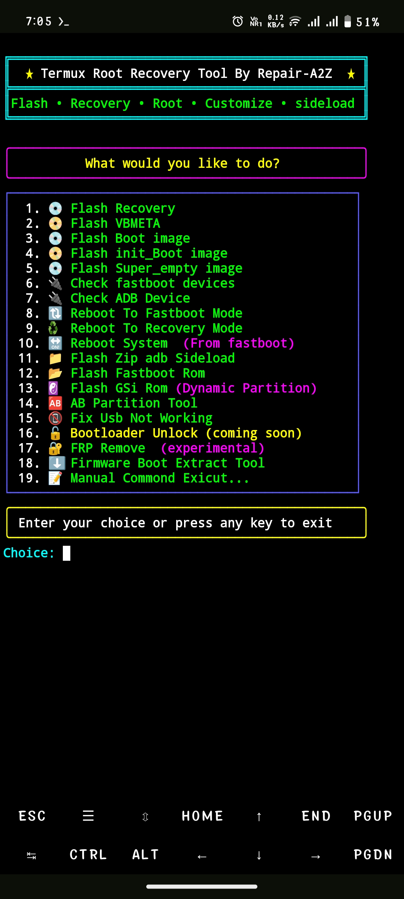

# Termux-Root-Recovery-Tool
This tool install Custom Recovery, Boot.img, VBmeta.img, init_boot.img, Flash Zip in sideload, install gsi-rom, Download boot.img without flash file, AB Partition Device flash, fastboot rom flash, ```bootloader unlocked devices only```


# Tool Features

1. No ❌Need to type📝 commond :- This tool offer you all commonds in option so no need to type any commonds just Enter your commond option nomber then past file location.

2. full function automatic usb🔌 & all ⬇️ pkg detect befor tool start for batter connection 

3. Flash img 📀file :- you can flash boot.img, init_boot.img, super_emty.img, vbmeta.img, magisk_patch.img, without typing any commond 

4. Reboot 🔃 option:- in single click you can reboot you device to fastboot, recovery, fastbootD, system

5. check 🔌 connected device:- this tool offer to check connected adb & fastboot device in your mobile

6. Flash Zip 🗃️ file :- You can flash any zip file ( magisk.zip, custom rom zip, kernel zip ) in sideload mode

7. 🆎 Partition Tool :- Using this tool you can flash root, recovery, boot, vbmeta in AB partition device 

8. 💿 Flash Gsi Rom :- using this tool you can easily flash gsi rom in your dynamic partition device 

9. FRP🔐 Remove:- Some older device FRP lock bypass using this tool.

10. Firmware Content Extracter:- you can download boot.img, init_boot.img, vendor_boot.img, system.img, super.img without downloading any flash file

11. USB Fix Tool :- if your device is not connecting then you can easily fix using this option 


# Tool Installation guide 👇👇

# install Termux App in phone & update PKG:- 

```Install``` [termux](https://f-droid.org/repo/com.termux_1022.apk) ```&``` [Termux-api](https://f-droid.org/repo/com.termux.api_1001.apk) ```apk Android 13 and lower Device```

```install``` [Termux-monet](https://github.com/Termux-Monet/termux-monet/releases/download/v0.119.0-b1-36/termux-app_v0.119.0-b1-36+apt-android-7-github-debug_universal.apk) ```&``` [Termux-monet-api](https://github.com/Termux-Monet/termux-api/releases/download/v0.50.1-5/termux-api_v0.50.1-5+github-debug.apk) ```apk Android 14 and Newer Device```

```console
yes | pkg update && upgrade
```
```console
termux-setup-storage
```
```console
pkg install termux-api
```
```console
yes | pkg install git
```
```console
yes | pkg install android-tools
```

# Installation Termux-Root-Recovery-Tool in Termux :-

```console
git clone https://github.com/Ishu43642/Termux-Root-Recovery-Tool.git
```

```console
cd Termux-Root-Recovery-Tool
```
```console
chmod -R +x .
```
# installation Termux-Adb :-
[Termux-Adb Fastboot](https://github.com/nohajc/termux-adb) 

```credit :- Termux-Adb``` [nohajc](https://github.com/nohajc)

```console
bash installadb.sh
```

# Run Tool with auto usb & pkg detect

```console
./start.sh
```
# Direct open tool
```console
./flash.sh
```
# Direct open usb fix tool
```console
./usbfix.sh
```

# For flashing Fastboot rom
1.Rename your fastboot rom folder to  ```stock-rom```

2.Copy ```stock-rom``` folder to  Download Folder Under internal storage 

 ```Now you can use Fastboot Rom Flash Option```

 # Credit :-
1. nohajc - for [Termux-Adb Fastboot](https://github.com/nohajc/termux-adb)

2. [Mahesh Verma](https://github.com/MaheshTechnicals) - For Ui Enhancement in my tool

# Subscribe My YouTube channel 

1. [Repair A2Z](https://youtube.com/@repaira2z)
2. [Repair A2Z Mix](https://youtube.com/@repaira2zmix)
