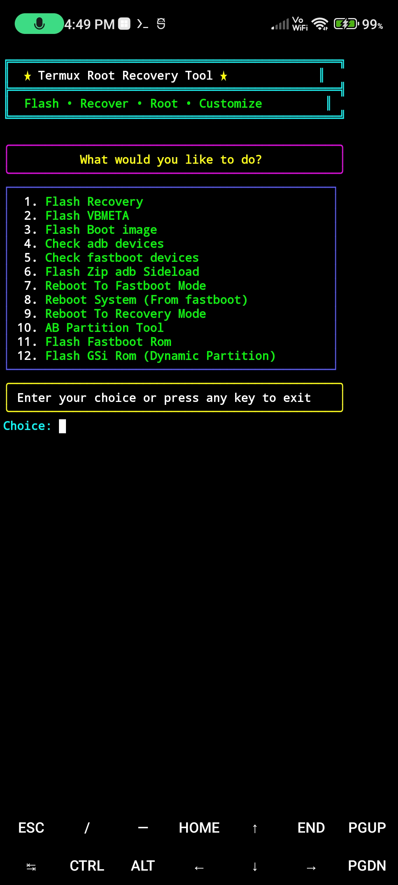

# Termux-Root-Recovery-Tool
This tool install GSi rom, Fastboot Rom, install Twrp Recovery, Boot.img, vbmeta.img Magisk Root in bootloader unlocked devices only

# install Termux App in phone & update PKG:- 

```Install``` [termux](https://f-droid.org/repo/com.termux_1022.apk) ```&``` [Termux-api](https://f-droid.org/repo/com.termux.api_1001.apk) ```apk Android 13 and lower Device```

```install``` [Termux-monet](https://github.com/Termux-Monet/termux-monet/releases/download/v0.119.0-b1-36/termux-app_v0.119.0-b1-36+apt-android-7-github-debug_universal.apk) ```&``` [Termux-monet-api](https://github.com/Termux-Monet/termux-api/releases/download/v0.50.1-5/termux-api_v0.50.1-5+github-debug.apk) ```apk Android 14 and Newer Device```

```console
yes | pkg update && upgrade
```
```console
termux-setup-storage
```
```console
pkg install termux-api
```
```console
yes | pkg install git
```

# Installation Termux-Root-Recovery-Tool in Termux :-

```console
git clone https://github.com/Ishu43642/Termux-Root-Recovery-Tool.git
```

```console
cd Termux-Root-Recovery-Tool
```
```console
chmod -R +x .
```
# installation Termux-Adb :-
[Termux-Adb Fastboot](https://github.com/nohajc/termux-adb) 

```credit :- Termux-Adb``` [nohajc](https://github.com/nohajc)

```console
bash installadb.sh
```

# Run Tool 

```console
./flash.sh
```

# For flashing Fastboot rom
1.Rename your fastboot rom folder to  ```stock-rom```

2.Copy ```stock-rom``` folder to  Download Folder Under internal storage 

 ```Now you can use Fastboot Rom Flash Option```
